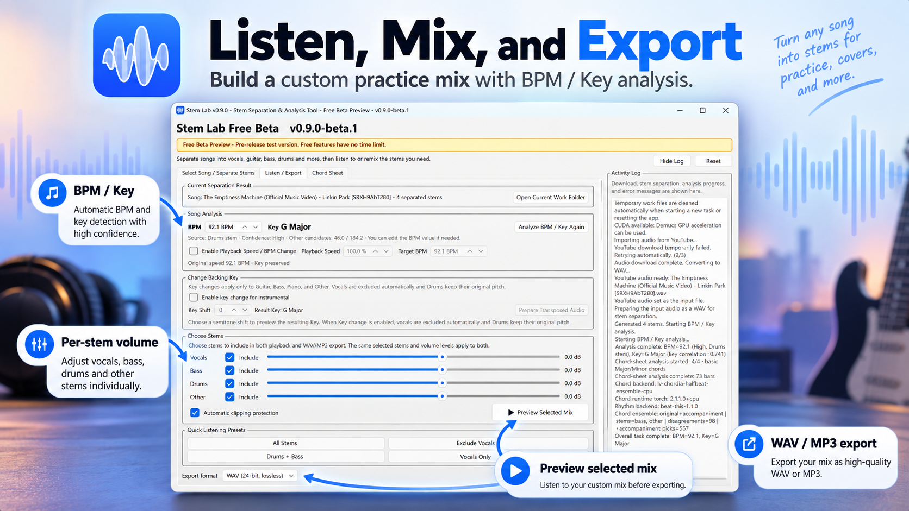
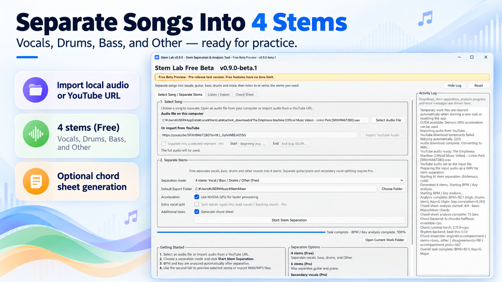
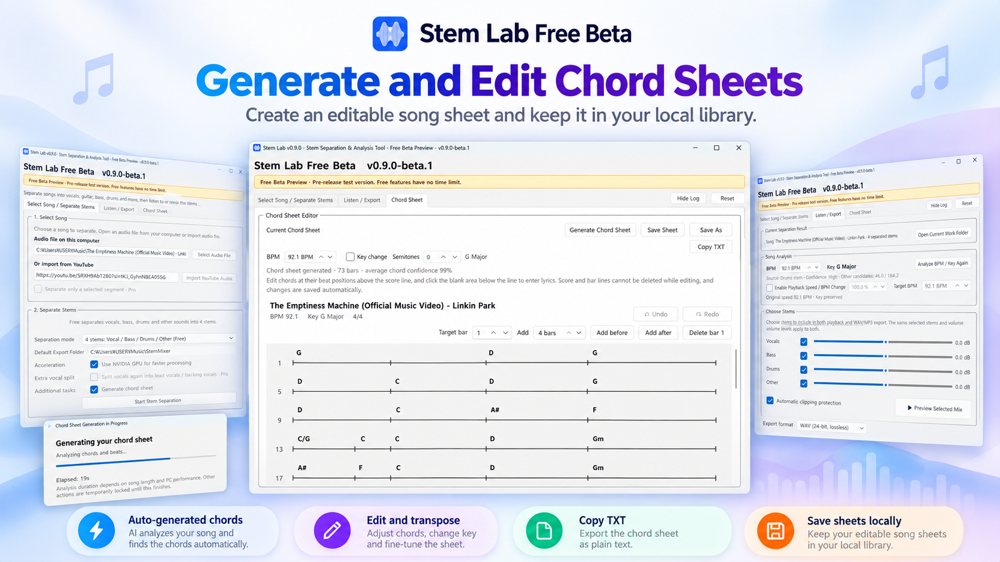

# Stem Lab Free

**Free Windows practice tool for musicians.**

Stem Lab Free combines stem separation, song analysis, practice playback, audio export, and editable chord sheets in one Windows desktop application.

> **Current Public Beta: v0.9.0-beta.1**  
> Windows 10 / 11 x64  
> No account. No subscription. No song limit. No expiration date.



## Download

### Stem Lab Free v0.9.0-beta.1

**Public Beta / Pre-release**

- Release page: https://github.com/Mankko/stem-lab-releases/releases/tag/v0.9.0-beta.1
- Windows installer: https://github.com/Mankko/stem-lab-releases/releases/download/v0.9.0-beta.1/StemLab-Setup-x64.exe
- Installer SHA256:

```text
370779452CF4E8D4DAFE282055B2C397664B077787C5E18DC6808F5D1F8ED400
```

> GitHub's **Latest** badge currently still points to the previous stable release, v0.8.8.  
> For the Free Beta, use the v0.9.0-beta.1 link above.

---

# Screenshots

## Separate Songs Into 4 Stems

Import local audio or a YouTube URL, choose the Free 4-stem mode, and optionally generate a chord sheet during the same workflow.



## Listen, Mix, and Export

Adjust each stem, analyze BPM / Key, preview the selected practice mix, and export WAV / MP3 from the same selection.


## Generate and Edit Chord Sheets

Generate an editable chord sheet, transpose or correct chords, copy text, and keep saved sheets in the local library.



---

# What Stem Lab Free can do

## 4-Stem Separation

Separate a full song into:

- Vocals
- Drums
- Bass
- Other

Each part can be independently included or excluded from the current practice mix, and its level can be adjusted separately.

Free Beta provides unlimited full-song 4-stem separation.

## Practice Player

The built-in Player uses the same stem selection and gain settings as audio export.

Practice features include:

- custom stem combinations
- per-stem volume adjustment
- pitch-preserving playback speed control
- target BPM control
- musical key transposition
- optional 4-beat count-in

## BPM / Key Analysis

Stem Lab analyzes:

- BPM
- Musical Key

Detected values can also be adjusted manually when needed.

## WAV / MP3 Export

Export the currently selected stem combination as:

- WAV
- MP3

The same Include selection and per-stem gain settings used by the Player are applied to export.

## Editable Chord Sheets

Stem Lab can generate an editable chord sheet from the current song.

You can:

- edit detected chords
- enter lyrics manually
- transpose displayed chords
- save practice sheets locally
- reopen saved sheets
- copy the current sheet as text

The Free edition does not provide app-owned PDF export, printing, or TXT file export.

---

# Free Beta Policy

Stem Lab Free Beta is the beta version of the actual **Free edition**.

It is **not** a time-limited Pro trial.

Free Beta currently has:

- no account requirement
- no subscription
- no song-count limit
- no expiration date
- unlimited full-song 4-stem separation

Advanced Pro-only features remain disabled.

---

# Installation

1. Download `StemLab-Setup-x64.exe`.
2. Run the installer.
3. Launch Stem Lab.
4. On the first stem-separation run, Stem Lab prepares/downloads the required AI runtime and model.

Python does not need to be installed separately.

The installer itself is intentionally kept relatively lightweight; heavyweight AI runtime components are prepared separately when first required.

---

# Beta Notes

This is a public beta.

Different Windows, GPU, audio-device, and security environments may behave differently.

Known pre-release note:

- first-run behavior on some physical non-NVIDIA Windows PCs may still need additional validation

Before upgrading from an older Stem Lab installation, backing up the following folder is recommended:

```text
%LOCALAPPDATA%\StemLab\saved_sheets
```

---

# Feedback / Bug Reports

If you encounter a bug, please open an Issue in this repository:

https://github.com/Mankko/stem-lab-releases/issues

When possible, include:

- Stem Lab version
- Windows version
- GPU model
- what you were doing when the problem occurred
- the error message or a screenshot

Please do **not** upload copyrighted third-party songs as bug-report attachments.

Feature suggestions are also welcome through Issues.

---

# Repository Purpose

This public repository is used only for **Stem Lab Windows distribution and public release information**.

The application source code, internal build scripts, tests, and development documents are maintained separately in a private source repository and are **not included here**.

## About GitHub's "Source code" downloads

GitHub automatically adds:

- `Source code (zip)`
- `Source code (tar.gz)`

to tag/release pages.

Those archives contain only the files tracked in this public **stem-lab-releases** repository for that tag. They do **not** contain the private Stem Lab application source code.

The actual downloadable Windows application is the Release Asset:

```text
StemLab-Setup-x64.exe
```

---

# 한국어 안내

## Stem Lab Free란?

Stem Lab Free는 음악 연습을 위한 Windows 데스크톱 프로그램입니다.

한 프로그램에서 다음 작업을 이어서 할 수 있습니다.

- 음원을 Vocals / Drums / Bass / Other 4파트로 분리
- BPM / Key 분석
- 파트별 Include 선택과 볼륨 조절
- 연습용 Player 재생
- 재생 속도 / 목표 BPM 조절
- Key 변경
- WAV / MP3 저장
- 코드악보 생성 및 편집
- 직접 가사 입력
- 코드악보 로컬 저장 / 다시 열기
- 현재 코드악보 TXT 내용 복사

현재 공개 버전은:

**Stem Lab Free v0.9.0-beta.1**

입니다.

이 버전은 기간 제한 체험판이 아니라 **향후 정식 Stem Lab Free의 공개 Beta 버전**입니다.

- 로그인 없음
- 구독 없음
- 곡 수 제한 없음
- 사용 기간 제한 없음
- 전체 곡 4 Stem 분리 횟수 제한 없음

## 다운로드

- Beta Release: https://github.com/Mankko/stem-lab-releases/releases/tag/v0.9.0-beta.1
- 설치파일: https://github.com/Mankko/stem-lab-releases/releases/download/v0.9.0-beta.1/StemLab-Setup-x64.exe

SHA256:

```text
370779452CF4E8D4DAFE282055B2C397664B077787C5E18DC6808F5D1F8ED400
```

## 소스코드 관련

이 저장소는 **설치파일 배포 전용 공개 저장소**입니다.

실제 Stem Lab 애플리케이션 소스, 테스트 코드, 내부 빌드 스크립트 및 개발 문서는 별도의 private 저장소에서 관리하며 이 저장소에는 포함하지 않습니다.

Release 페이지에 GitHub가 자동으로 표시하는 `Source code (zip)` / `Source code (tar.gz)`는 이 공개 배포 저장소에 들어있는 파일만 묶은 자동 생성 아카이브입니다.

실제 Stem Lab 프로그램 소스코드는 포함되어 있지 않습니다.

---

© MDI Soft — Stem Lab
